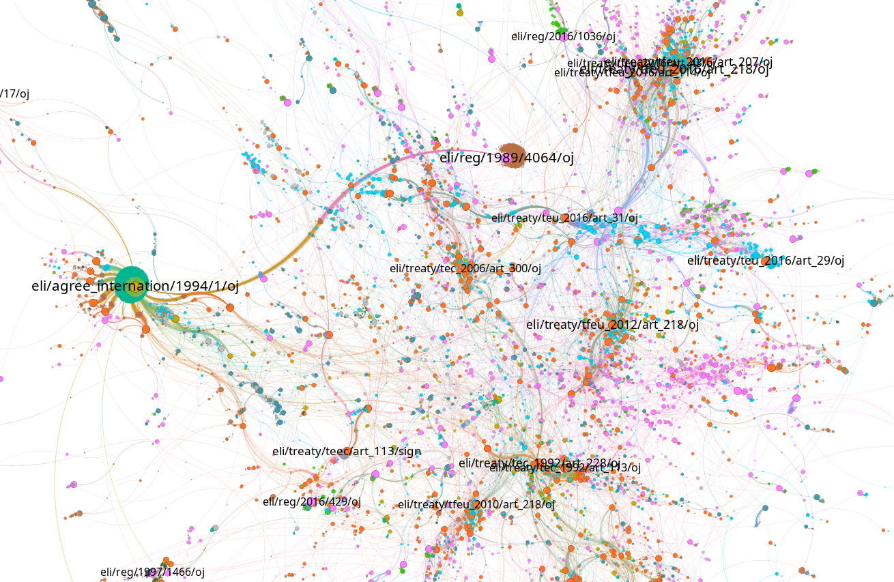

# rdf2gexf

Converts RDF knowledge graphs to a Gephi gexf project file that can be opened in Gephi. Supports single RDF file, multiple files in a folder, or remote SPARQL endpoint URL. Can work either in a _"direct and simple conversion"_ mode, turning triples into edges, or using a set of SPARQL queries to define exactly the structure of the nodes and edges that should appear in the Gexf file.

## How to run

1. Make sure you have Java installed
2. Download the application from the [release section](https://github.com/sparna-git/rdf2gexf/releases)
3. Have some RDF data at hand (one or more RDF file, or a SPARQL service you can query)
4. Open a command-line in the directory you downloaded the app, and run `java -jar rdf2gexf-x.y-onejar.jar --help` to list the available commands and options
5. Run a conversion command, typically the following:

```sh
java -jar target/rdf2gexf-1.0-onejar.jar sparql \
--input http://my.sparql.endpoint \
--edges queries/edges.rq \
--attributes queries/attributes.rq \
--labels queries/labels.rq \
--output output.gexf
```

6. Download and run [Gephi](https://gephi.org/)
7. In Gephi, open the generated gexf file


## Available commands and options

### direct convertion (discouraged)

### SPARQL-based conversion (preferred)

The `sparql` commands takes a set of SPARQL queries to build the structure of the Gephi graph. The command synopsis is the following:

```
java -jar target/rdf2gexf-1.0-onejar.jar sparql \
--input <file or directory or url of SPARQL endpoint> \
--edges <SPARQL query file to create edges> \
--attributes <SPARQL query file to create attributes> \
--labels <SPARQL query file to create label> \
--output <output gexf file>
```

The full options of the command are:

```
    sparql      Converts RDF data to GEXF format using SPARQL queries.
      Usage: sparql [options]
        Options:
          -a, --attributes
            Path to the file containing the SPARQL query to retrieve 
            attributes, e.g. 'sparql/attribute.rq'
          -d, --dates
            Path to the file containing the SPARQL query to retrieve date 
            ranges, e.g. 'sparql/dates.rq'
        * -e, --edges
            Path to the file containing the SPARQL query to retrieve edges, 
            e.g. 'sparql/edges.rq'
        * -i, --input
            Path to RDF input file, or directory containing RDF files, or URL 
            of a SPARQL endpoint.
          -l, --labels
            Path to the file containing the SPARQL query to retrieve labels, 
            e.g. 'sparql/labels.rq'
        * -o, --output
            Path to GEXF output file
```

*/!\ Attention :* the provided queries MUST follow the rules below:

#### edges query

This query defines the graph structure. 
The edges query MUST return the 3 variables: `?subject`, `?edge`, `?object`.

An example of such query is:

```sparql
PREFIX cdm: <http://publications.europa.eu/ontology/cdm#>
PREFIX xsd: <http://www.w3.org/2001/XMLSchema#>
SELECT ?subject ?edge ?object
WHERE {
    ?subject a cdm:resource_legal .
    ?subject cdm:resource_legal_in-force true .
    ?subject cdm:resource_legal_based_on_resource_legal ?object .
    BIND(cdm:resource_legal_based_on_resource_legal as ?edge)
}
```

This query is mandatory.

#### labels query

This query returns the labels of each node in the graph. Typically from an `rdfs:label`, `skos:prefLabel`, or anything.
The labels query MUST use the `?subject` variable to hold the node in the graph, and MUST return the 2 variables `?subject` and `?label`.

An example of such query is:

```sparql
PREFIX cdm: <http://publications.europa.eu/ontology/cdm#>
PREFIX xsd: <http://www.w3.org/2001/XMLSchema#>
SELECT ?subject ?label
WHERE {
    ?subject cdm:resource_legal_eli ?eli .
    BIND(STRAFTER(STR(?eli), "http://data.europa.eu/") AS ?label)
}
```

This query is optional. If not provided, the following query is used:

```sparql
# Default labels query
# Selects the first present : foaf:name, rdfs:label in english or without language, skos:prefLabel in english or without language
PREFIX skos: <http://www.w3.org/2004/02/skos/core#>
PREFIX org: <http://www.w3.org/ns/org#>
PREFIX foaf: <http://xmlns.com/foaf/0.1/>
PREFIX epvoc: <https://data.europarl.europa.eu/def/epvoc#>
SELECT ?subject ?label
WHERE {
	OPTIONAL { ?subject foaf:name ?foafName }
	OPTIONAL { ?subject skos:prefLabel ?prefLabel . FILTER(lang(?prefLabel) = "en" || lang(?prefLabel) = "") }
	OPTIONAL { ?subject rdfs:label ?rdfsLabel . FILTER(lang(?rdfsLabel) = "en" || lang(?rdfsLabel) = "") }
	
	BIND(COALESCE(?foafName, ?prefLabel, ?rdfsLabel) AS ?label)
}
```

#### attributes query

This query returns the attributes of each node in the graph. Typically the value of `rdf:type`, and other attributes.
The attributes query MUST use the `?subject` variable to hold the node in the graph, and MUST return 3 variables : `?subject`, `?attribute` as the attribute type, and `?value` as the attribute value (a URI or a literal).

An example of such query is:

```sparql
PREFIX cdm: <http://publications.europa.eu/ontology/cdm#>

SELECT ?subject ?attribute ?value
WHERE {
    ?subject cdm:work_has_resource-type ?value .
	BIND(cdm:work_has_resource-type AS ?attribute)
}
```

This query is optional. If not provided, the following query is used:

```sparql
# Default attributes query
# Selects the rdf:type value and any other property pointing to a skos:Concept
PREFIX skos: <http://www.w3.org/2004/02/skos/core#>
PREFIX org: <http://www.w3.org/ns/org#>
PREFIX foaf: <http://xmlns.com/foaf/0.1/>
PREFIX epvoc: <https://data.europarl.europa.eu/def/epvoc#>
PREFIX rdf: <http://www.w3.org/1999/02/22-rdf-syntax-ns#>
SELECT ?subject ?attribute ?value
WHERE {
	{ 
		?subject a ?value .
		BIND(rdf:type AS ?attribute)
	}
	UNION
	{
		?subject ?attribute ?value .
		?value a skos:Concept .
	}
}
```


#### dates query

TODO


## Typical actions in Gephi to view your RDF graph

1. Apply a layout algorithm : Use "Force Atlas 2".
2. Give colors to nodes based on the type attribute : Appearance > Nodes > Partition > Choose an attribute
3. Size the nodes based on (incoming or outgoing) degree : Appearance > Size icon > Ranking > Degree
4. Print labels only of biggest nodes : Filter > Topology > Degree Range > drag and drop to Queries below > set the parameters. Then click on filter. Then click on icon above "hide node/edges labels if not in filtered graph" 
5. Click on "Show node labels" button
6. Go in "Preview" tab, regenerate the preview, export as SVG/PNG/PDF

This is illustrated in the screencast below:


## Gallery

EU in-force legislation from Cellar SPARQL endpoint. Links shows the "based_on" links (acts legally based on another act). ELI identifiers of acts that are most often used as basis are shown


